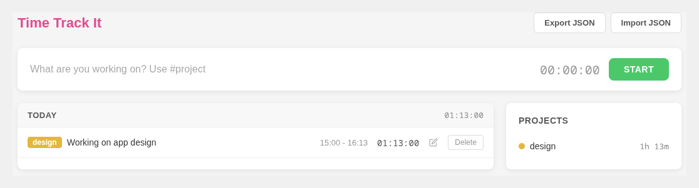

# Time Track It

### The hassle-free, offline time tracker.

**[Live demo →](http://timetrackit.amissaglia.dev.br/)**



## Features

- **One-click timer** — describe what you're working on and hit Start
- **Project tagging** — use `#project` inline to tag entries automatically
- **Project summary** — see total time per project at a glance
- **Edit & delete entries** — full control over your time log
- **Import / Export JSON** — back up or move your data anytime
- **100% offline** — all data stored locally in your browser via IndexedDB, no account needed

## Tech Stack

- [Vue 3](https://vuejs.org/)
- [Vite](https://vite.dev/)
- [Dexie.js](https://dexie.org/) (IndexedDB)

## Getting Started

```bash
npm install
npm run dev
```

Open [http://localhost:5173](http://localhost:5173) in your browser.

## Build

```bash
npm run build
```

Output goes to `docs/` and can be served as a static site (e.g. GitHub Pages).
